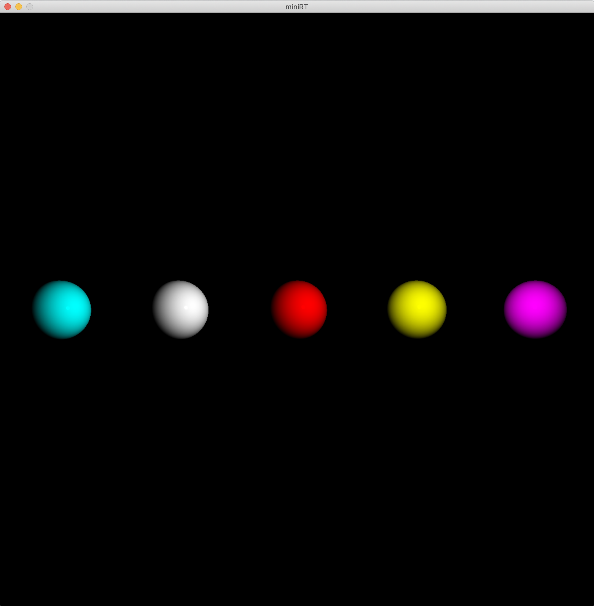
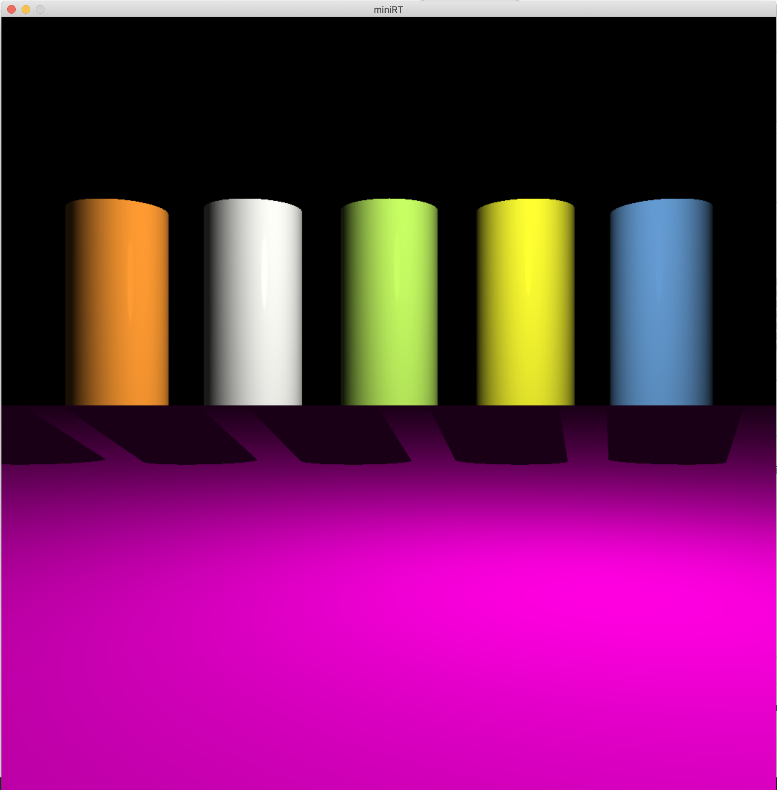
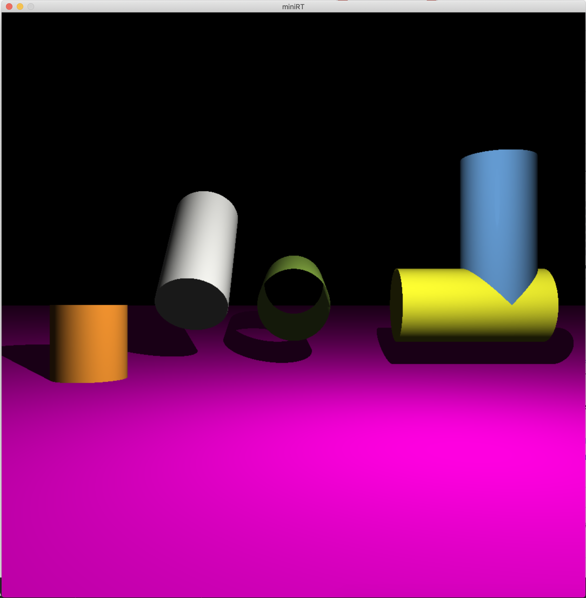
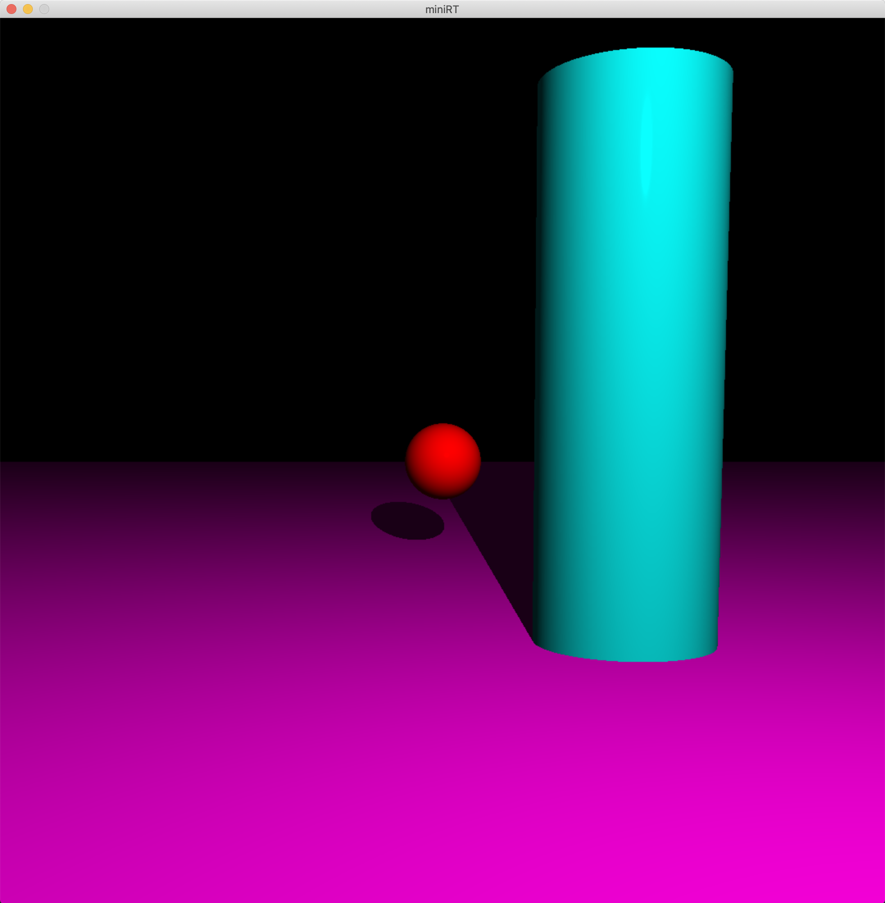

# miniRT

Realization of ray tracing with planes, cylinders, spheres.
It is possible to move in space, rotate the camera and change objects.

## Technologies

1. C
2. Make

## Launch

1. Build a project using Makefile

   ```sh
   $ make
   ```

2. Run the program with one argument (map), like this:

   ```sh
   $ ./miniRT maps/c_s_s_s.rt
   ```
   
3. Control
  - Q             = CAMERA LEFT
  - A             = CAMERA RIGHT
  - W             = CAMERA UP
  - S             = CAMERA DOWN
  - E             = CAMERA FORWARD
  - R             = OBJECT ROTATE
  - Left Arrow    = CAMERA ROTATE LEFT
  - Right Arrow   = CAMERA ROTATE RIGHT
  - Up Arrow      = CAMERA ROTATE UP
  - Down Arrow    = CAMERA ROTATE DOWN
  - Mouse Click   = CHOOSE FIGURE
  - Mouse Scroll  = CHANGE OBJECT SIZE

## Game

  
  
  
  
  
